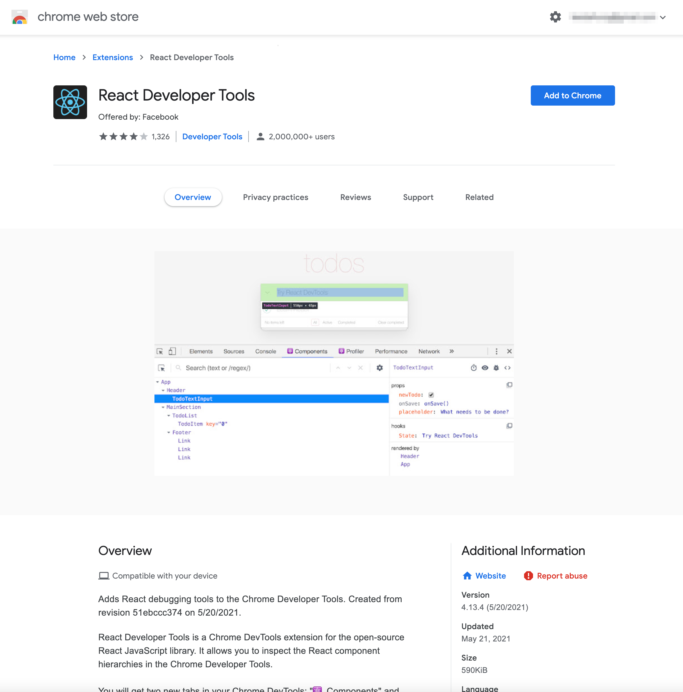
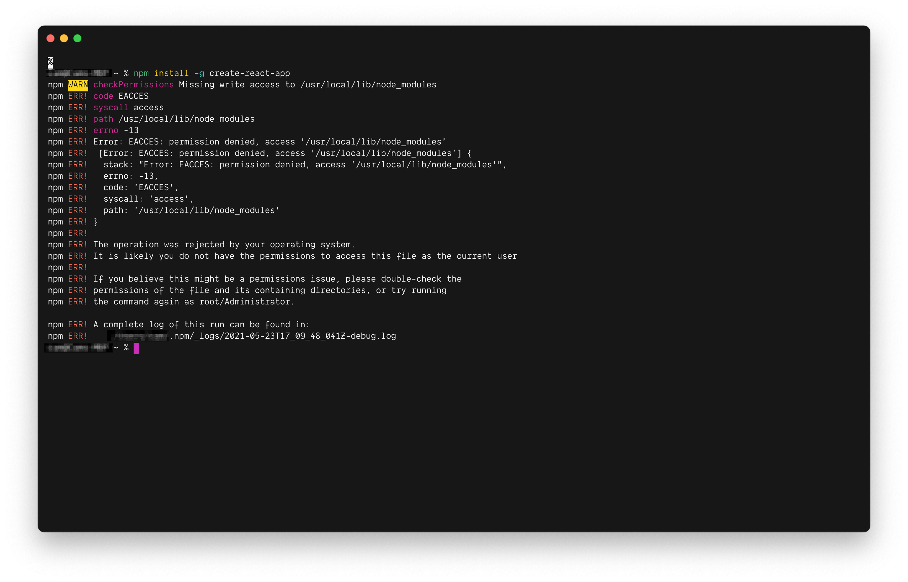
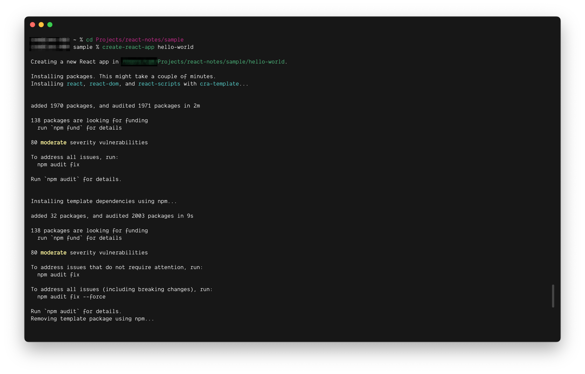
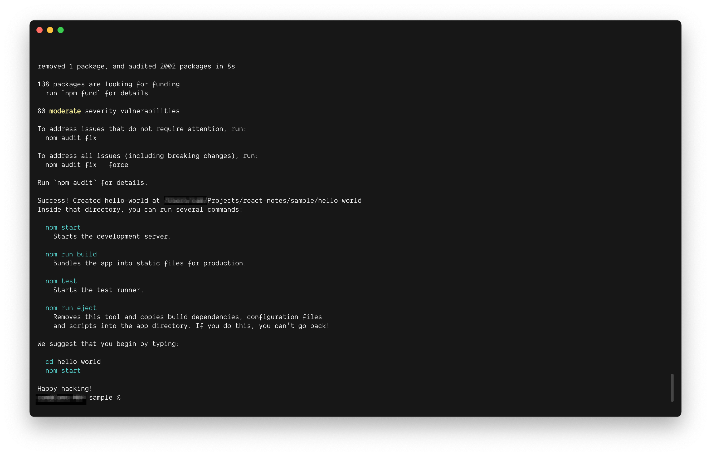
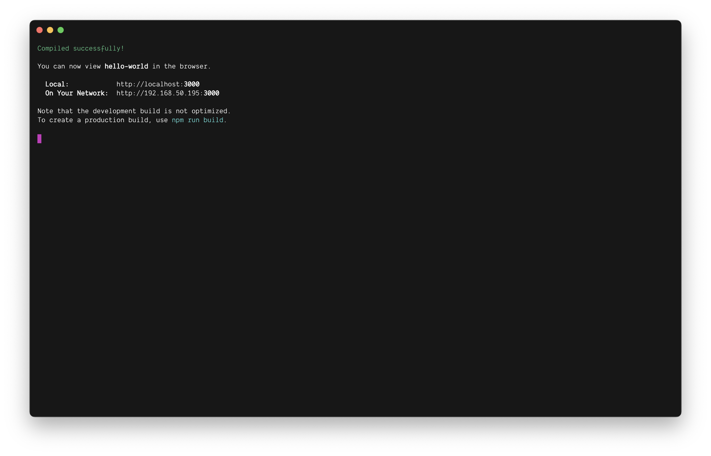
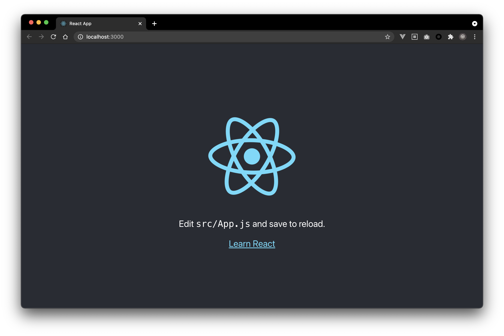

# React 脚手架

## React Developer Tools

Chrome Web Store : <https://chrome.google.com/webstore/detail/react-developer-tools/fmkadmapgofadopljbjfkapdkoienihi?hl=en-US>



点击"Add to Chrome"安装React开发者工具到Chrome

## 安装脚手架

React脚手架：`create-reat-app`，使用`npm`全局安装脚手架

``` bash
npm install -g create-reat-app
```

在macOS安裝全局的package时，会出现如下图的权限问题



使用`sudo`切换到管理员身份后安装可以解决全局安装到权限问题


## 创建项目

使用脚手架创建`hello-world`项目

``` bash
# 切换到想要创建项目的路径
cd Projects/react-notes/sample

# 使用create-reat-app创建项目
create-reat-app hello-world
```

等待脚手架创建项目文件和依赖包



创建成功后会提示一些相关的npm指令，如果有安装yarn，即提示yarn相关的指令



## npm / yarn 命令

`npm start`  
`yarn start`  
启动开发服务器

`npm run build`  
`yarn build`  
打包应用

`npm test`  
`yarn test`  
执行测试

`npm run eject`  
`yarn eject`  
把webpack所有的相关配置文件暴露在应用的目录下，并且此操作不可逆

## 启动项目

进入应用目录，执行启动指令

``` bash
# 进入hello-world目录
cd hello-world

# 执行启动命令
npm start
```



等待项目编译，编译成功并启动后会自动打开默认浏览器



## 项目结构

**node_modules**: 依赖包的存放目录

**public**`%PUBLIC_URL%`: 静态资源目录  
-- **favicon.icon**: 网站图标  
-- `index.html`: 应用主页  
-- **logo192.png**: 192x192 logo  
-- **logo512.png**: 512x512 logo  
-- **manifest.json**: 应用加壳配置  
-- **robots.txt**: 爬虫协议

**src**: 源代码目录  
-- **App.css**: App组件样式  
-- `App.js`: App组件  
-- **App.test.js**: App组件测试脚本  
-- **index.css**: 通用样式  
-- `index.js`: 入口文件  
-- **logo.svg**: logo svg  
-- **reportWebCitals.js**: 页面性能分析脚本，搭配web-vitals使用  
-- **setupTests.js**: 应用测试脚本，依赖jest-dom


